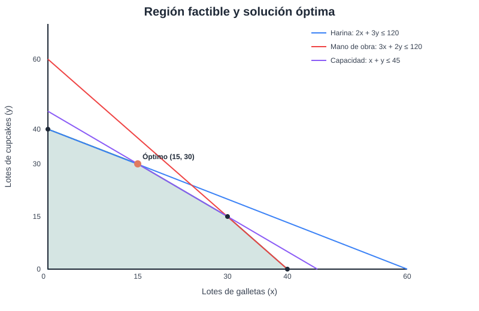

# Aplicación de la programación lineal para optimizar la producción de Dulce Trigo

## Índice

1. Introducción
2. Planteamiento del problema
3. Justificación
4. Objetivos generales y mediatos
5. Marco teórico
6. Metodología
7. Datos del caso
8. Formulación del modelo
9. Solución mediante el método gráfico
10. Resultado óptimo
11. Aplicación web
12. Evaluación de resultados
13. Conclusiones
14. Recomendaciones
15. Apéndice
16. Video demostrativo
17. Cuestionamientos del proyecto
18. Bibliografía y e-grafía
19. Cronograma y entrega

> Al trasladar este borrador a Word o PDF se deben actualizar los números de página del índice.

## 1. Introducción

La Investigación de Operaciones proporciona modelos matemáticos para apoyar la toma de decisiones cuando existen recursos limitados. Una de sus herramientas principales es la programación lineal, que permite determinar la mejor combinación de actividades cuando la relación entre los recursos y las decisiones puede expresarse mediante ecuaciones o desigualdades lineales.

Este proyecto presenta un caso de producción para la empresa Dulce Trigo. Se analizan dos productos y tres recursos limitados. El modelo se resuelve mediante el método gráfico y se acompaña con una aplicación web que permite modificar los datos y observar el efecto sobre la solución.

## 2. Planteamiento del problema

Dulce Trigo produce semanalmente lotes de galletas y cupcakes. Cada producto requiere una cantidad determinada de harina, mano de obra y capacidad de producción. La empresa necesita definir cuántos lotes de cada producto debe fabricar para obtener el mayor margen de contribución sin superar los recursos disponibles.

La decisión se representa con dos variables:

- `x`: lotes de galletas por semana.
- `y`: lotes de cupcakes por semana.

La pregunta central es:

> ¿Cuál es la combinación de lotes de galletas y cupcakes que maximiza el margen semanal de Dulce Trigo?

## 3. Justificación

Resolver el problema mediante programación lineal permite sustituir una decisión intuitiva por un procedimiento cuantitativo. El análisis identifica la combinación más conveniente, muestra qué recursos se utilizan por completo y determina qué capacidad permanece disponible.

La aplicación web facilita la demostración del modelo porque permite ingresar los valores, observar la región factible, revisar los puntos extremos y comprobar la solución óptima.

## 4. Objetivos generales y mediatos

### 4.1 Objetivo general

Aplicar la programación lineal y el método gráfico para determinar la combinación de productos que maximiza el margen semanal de Dulce Trigo.

### 4.2 Objetivos mediatos (específicos)

1. Definir las variables de decisión del problema.
2. Identificar el margen y el consumo de recursos de cada producto.
3. Formular la función objetivo y las restricciones.
4. Representar gráficamente la región factible.
5. Evaluar los puntos extremos y seleccionar la solución óptima.
6. Desarrollar una aplicación web para demostrar el modelo y sus resultados.

## 5. Marco teórico

### 5.1 Investigación de Operaciones

La Investigación de Operaciones utiliza modelos matemáticos, datos y métodos analíticos para apoyar decisiones en sistemas que tienen objetivos y restricciones.

### 5.2 Programación lineal

La programación lineal busca maximizar o minimizar una función lineal sujeta a restricciones lineales y condiciones de no negatividad.

### 5.3 Elementos del modelo

- **Variables de decisión:** representan las cantidades que deben determinarse.
- **Función objetivo:** expresa el margen que se desea maximizar.
- **Restricciones:** representan los límites de los recursos.
- **Región factible:** conjunto de combinaciones que cumplen todas las restricciones.
- **Puntos extremos:** intersecciones que se evalúan para encontrar la solución óptima.
- **Holgura:** diferencia entre el recurso disponible y el recurso utilizado.

### 5.4 Método gráfico

El método gráfico permite resolver modelos de programación lineal con dos variables. Primero se representan las rectas de las restricciones, luego se identifica la región factible y finalmente se evalúa la función objetivo en sus puntos extremos.

## 6. Metodología

1. Definir los productos y las unidades de decisión.
2. Establecer el margen de contribución por lote.
3. Registrar el consumo de cada recurso por producto.
4. Formular la función objetivo y las restricciones.
5. Calcular las intersecciones de las rectas.
6. Verificar cuáles puntos cumplen todas las restricciones.
7. Evaluar el margen en cada punto extremo.
8. Interpretar la solución y el uso de los recursos.
9. Comprobar los cálculos mediante la aplicación web.

## 7. Datos del caso

| Recurso | Galletas `x` | Cupcakes `y` | Disponibilidad semanal |
|---|---:|---:|---:|
| Harina | 2 kg | 3 kg | 120 kg |
| Mano de obra | 3 horas | 2 horas | 120 horas |
| Capacidad de producción | 1 lote | 1 lote | 45 lotes |

| Producto | Margen por lote |
|---|---:|
| Galletas | Q40 |
| Cupcakes | Q50 |

## 8. Formulación del modelo

### 8.1 Función objetivo

\[
\text{Maximizar } Z = 40x + 50y
\]

### 8.2 Restricciones

Harina:

\[
2x + 3y \leq 120
\]

Mano de obra:

\[
3x + 2y \leq 120
\]

Capacidad:

\[
x + y \leq 45
\]

Condiciones de no negatividad:

\[
x \geq 0, \qquad y \geq 0
\]

## 9. Solución mediante el método gráfico

### 9.1 Interceptos

| Restricción | Intercepto en `x` | Intercepto en `y` |
|---|---:|---:|
| `2x + 3y = 120` | `(60, 0)` | `(0, 40)` |
| `3x + 2y = 120` | `(40, 0)` | `(0, 60)` |
| `x + y = 45` | `(45, 0)` | `(0, 45)` |

### 9.2 Puntos extremos factibles

| Punto | Cálculo del margen | Margen |
|---|---|---:|
| `(0, 0)` | `40(0) + 50(0)` | Q0 |
| `(40, 0)` | `40(40) + 50(0)` | Q1,600 |
| `(30, 15)` | `40(30) + 50(15)` | Q1,950 |
| `(15, 30)` | `40(15) + 50(30)` | **Q2,100** |
| `(0, 40)` | `40(0) + 50(40)` | Q2,000 |

La intersección entre las restricciones de harina y mano de obra es `(24, 24)`, pero no es factible porque `24 + 24 = 48` supera la capacidad máxima de 45 lotes.

## 10. Resultado óptimo

La combinación que produce el mayor margen es:

- `x = 15` lotes de galletas.
- `y = 30` lotes de cupcakes.

El margen máximo es:

\[
Z = 40(15) + 50(30) = Q2,100
\]

### Uso de recursos

| Recurso | Utilizado | Disponible | Holgura |
|---|---:|---:|---:|
| Harina | 120 kg | 120 kg | 0 kg |
| Mano de obra | 105 horas | 120 horas | 15 horas |
| Capacidad | 45 lotes | 45 lotes | 0 lotes |

La harina y la capacidad son recursos totalmente utilizados. La mano de obra conserva una holgura de 15 horas.

## 11. Aplicación web (práctica y reporte de resultados)

El **Sistema de Optimización de Producción** fue desarrollado en Python con Streamlit. Utiliza Dulce Trigo como caso de estudio y demuestra el modelo de forma interactiva.

Esta sección corresponde a la parte práctica del marco teórico: presenta el sistema desarrollado, los resultados obtenidos y la evidencia que se explicará en el video.

La aplicación permite:

- Ingresar el margen de cada producto.
- Modificar el consumo de recursos.
- Modificar la disponibilidad.
- Generar el modelo matemático.
- Calcular las intersecciones.
- Separar los puntos factibles de los no factibles.
- Evaluar los puntos extremos.
- Mostrar la región factible.
- Presentar la solución óptima y las holguras.

El código fuente y las instrucciones de ejecución se encuentran en el repositorio del proyecto. La versión publicada se compartirá mediante una URL de Streamlit Community Cloud.

## 12. Evaluación de resultados

El modelo determina que la producción combinada de 15 lotes de galletas y 30 lotes de cupcakes es superior a las demás combinaciones evaluadas. La solución utiliza completamente la harina y la capacidad de producción, mientras que aún existe disponibilidad de mano de obra.

La aplicación permite modificar los valores para observar cómo cambia la región factible y verificar que la solución depende de los márgenes y de la disponibilidad de los recursos.

### 12.1 Indicadores y mediciones

| Indicador | Resultado | Interpretación |
|---|---:|---|
| Harina utilizada | 100% | Es un recurso limitante. |
| Mano de obra utilizada | 87.5% | Quedan 15 horas disponibles. |
| Capacidad utilizada | 100% | Es un recurso limitante. |
| Margen máximo | Q2,100 | Se obtiene en `(15, 30)`. |
| Promedio del margen en los puntos extremos | Q1,530 | Promedio de los cinco puntos evaluados. |
| Rango entre el menor y mayor margen | Q2,100 | Diferencia entre Q0 y Q2,100. |

### 12.2 Comentarios de los resultados

La solución óptima no significa producir la mayor cantidad de un solo producto, sino encontrar la combinación que aprovecha mejor los recursos. La harina y la capacidad determinan la frontera de la solución, mientras que las 15 horas de mano de obra no utilizadas indican que aumentar únicamente ese recurso no cambiaría el resultado actual.

## 13. Conclusiones

1. La programación lineal permite representar la decisión de producción mediante variables, una función objetivo y restricciones.
2. El método gráfico permite identificar visualmente las combinaciones factibles y seleccionar el punto con mayor margen.
3. La solución óptima del caso es producir 15 lotes de galletas y 30 lotes de cupcakes.
4. El margen máximo obtenido es de Q2,100 por semana.
5. La harina y la capacidad de producción son los recursos limitantes del modelo.
6. La aplicación web facilita la comprobación y demostración del procedimiento.

## 14. Recomendaciones

1. Mantener la producción dentro de la combinación óptima mientras se conserven los mismos valores del modelo.
2. Evaluar primero un aumento de harina o capacidad, porque ambos recursos se utilizan completamente.
3. No asignar más mano de obra sin revisar antes si aumentan la demanda o los demás recursos.
4. Utilizar la aplicación para probar escenarios alternativos antes de modificar la planificación.

## 15. Apéndice

El apéndice final debe incluir las siguientes evidencias:

- **Apéndice A:** tabla de datos del caso.
- **Apéndice B:** gráfica de las restricciones y región factible.
- **Apéndice C:** tabla de puntos extremos y márgenes.
- **Apéndice D:** capturas de la aplicación web.
- **Apéndice E:** captura de la URL pública desplegada.
- **Apéndice F:** evidencia de las pruebas automáticas del sistema.

Las tablas de datos, puntos extremos y uso de recursos ya están incorporadas en las secciones correspondientes; al generar el documento final se deben repetir o referenciar dentro de este apéndice.

### Gráfica del caso base

## 16. Video demostrativo

El video presentará, en este orden:

1. El problema de Dulce Trigo.
2. Las variables y los datos.
3. La función objetivo y las restricciones.
4. La aplicación web.
5. La solución gráfica.
6. Los puntos extremos y el margen de cada uno.
7. La solución óptima y el uso de los recursos.

## 17. Cuestionamientos del proyecto

### 17.1 ¿Qué lo motivó a seleccionar el tema elegido?

Se seleccionó la programación lineal porque es un tema central de Investigación de Operaciones y permite demostrar de forma clara cómo se toman decisiones cuando existen recursos limitados. También se eligió porque puede integrarse con una aplicación web, relacionando los conocimientos del curso con la formación de Ingeniería en Sistemas.

### 17.2 Evaluación de los motivos internos y externos

Los motivos internos fueron el interés por comprender mejor el método gráfico, practicar la formulación de modelos y desarrollar una herramienta funcional. Los motivos externos fueron los requisitos del curso, la necesidad de presentar un caso práctico y la posibilidad de compartir la aplicación mediante una plataforma gratuita.

### 17.3 ¿Qué estrategias utilizó para el desarrollo del proyecto?

Se delimitó el problema a dos variables para mantenerlo resoluble mediante el método gráfico. Primero se formuló y comprobó el modelo matemático; después se desarrolló el solver, la interfaz web y las gráficas. Finalmente se realizaron pruebas automáticas, pruebas manuales y control de versiones mediante GitHub.

### 17.4 ¿Es necesario el financiamiento para este tipo de proyectos académicos?

No es indispensable para este proyecto porque se utilizaron herramientas gratuitas, un entorno local y un servicio de despliegue gratuito. Sin embargo, un proyecto de mayor alcance podría requerir financiamiento para servidores, dominio, soporte técnico, diseño y mantenimiento.

### 17.5 ¿Le pondría algún precio a las actividades del tema desarrollado y cómo financió su proyecto?

Como proyecto académico no se cobrará por su elaboración. El desarrollo se financió con recursos propios, computadora, conexión a Internet y herramientas gratuitas. En un escenario comercial se podría ofrecer una versión educativa sin costo y cobrar por personalizaciones, soporte o adaptación del modelo a una empresa.

### 17.6 ¿Cuál sería el mercado meta para su proyecto?

El mercado meta principal serían estudiantes y docentes que necesiten demostrar programación lineal. Como mercado secundario se consideran micro y pequeñas empresas de producción que necesiten analizar combinaciones de productos y recursos limitados.

### 17.7 Cronograma de actividades

| Fecha | Actividad |
|---|---|
| 5 de octubre de 2026 | Selección del tema y definición del alcance. |
| 6 de octubre de 2026 | Elaboración del problema, objetivos y datos del caso. |
| 7 de octubre de 2026 | Formulación y verificación del modelo matemático. |
| 8 de octubre de 2026 | Desarrollo del solver y la gráfica. |
| 9 de octubre de 2026 | Construcción de la interfaz web. |
| 10 de octubre de 2026 | Pruebas locales y corrección de resultados. |
| 11 de octubre de 2026 | Organización del repositorio y despliegue web. |
| 12 de octubre de 2026 | Redacción del informe y preparación de evidencias. |
| 13 de octubre de 2026 | Grabación y revisión del video. |
| 14 de octubre de 2026 | Integración de apéndices, bibliografía y cuestionamientos. |
| 15 de octubre de 2026 | Revisión final del documento y del enlace público. |
| 16 de octubre de 2026 | Entrega virtual en Canvas antes de las 23:00 horas. |

### 17.8 ¿Qué lecciones aprendió?

Se aprendió que la formulación correcta del modelo es tan importante como la programación. También se comprendió la relación entre restricciones, región factible y solución óptima, así como la importancia de validar los cálculos antes de publicar una aplicación.

### 17.9 ¿Qué riesgos potenciales surgieron y cómo los solventó?

Los principales riesgos fueron formular restricciones incorrectas, obtener una región factible vacía o no acotada, cometer errores en las intersecciones y enfrentar problemas de dependencias durante el despliegue. Se solventaron mediante cálculo manual, validaciones del solver, pruebas automáticas, ejecución local y documentación de dependencias.

### 17.10 ¿Cómo aseguró la calidad del trabajo?

La calidad se aseguró comparando el resultado del sistema con la solución manual del método gráfico. Además, se ejecutaron seis pruebas automáticas, se verificó la compilación del código, se probó la interacción de Streamlit y se comprobó que el servidor local respondiera correctamente. El código también quedó versionado en GitHub.

## 18. Bibliografía y e-grafía

- Universidad Mariano Gálvez. (2026). *Introducción a la Investigación de Operaciones*. Material de clase.
- Universidad Mariano Gálvez. (2026). *Aplicación de la Investigación de Operaciones*. Material de clase.
- Universidad Mariano Gálvez. (2026). *Programación lineal: ejemplos usando el método gráfico*. Material de clase.
- Universidad Mariano Gálvez. (2026). *Método gráfico: teoría*. Material de clase.
- Universidad Mariano Gálvez. (2026). *Método Simplex*. Material de clase.
- Streamlit. (2026). *Streamlit Community Cloud documentation*. https://docs.streamlit.io/deploy/streamlit-community-cloud
- Python Software Foundation. (2026). *Python Documentation*. https://docs.python.org/3/

## 19. Cronograma y entrega

La entrega virtual se preparará en formato PDF para subirla a Canvas el 16 de octubre de 2026 antes de las 23:00 horas. También se preparará una copia impresa para la exposición física. El video, la URL pública de la aplicación y el repositorio se incorporarán como evidencias complementarias.
